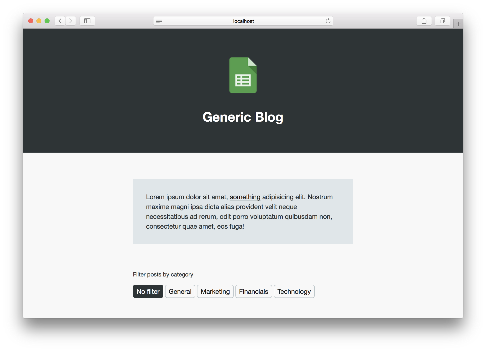

# Google Sheets CMS
Example of a blog powered by Google Sheets, Google Forms and Google Apps Scripts. New posts are added via a Google Forms interface and stored in a Google Sheets spreadsheet. Google Apps Script is used to create an API to make the content accessible in an easy to use format. The blog is designed as a single page application with pagination and category filtering.



## Google Apps Script API
Google Apps Script is a platform to  extend Google’s G Suite of online products through a scripting language derived from JavaScript. It’s analogous to VBA, which is built into the majority of Microsoft Office products. To get started with Google Apps Script you can access the online editor by going to *Tools > Script Editor* in the menu bar from a Google Sheets spreadsheet. A script can then be made publicly available by going to *Publish > Deploy as webapp* from the script editor menu bar. Ensure the app is being executed as *me* and that *anyone, even anonymous* has access.

```
var API_KEY = '';
var SPREADSHEET_ID = '';
var RESULTS_PER_PAGE = 5;

function doGet(e) {
  if (!isAuthorized(e)) {
    return buildErrorResponse('not authorized');
  }
  
  var options = {
    page: getPageParam(e),
    category: getCategoryParam(e)
  }
  
  var spreadsheet = SpreadsheetApp.openById(SPREADSHEET_ID);
  var worksheet = spreadsheet.getSheets()[0];
  var rows = worksheet.getDataRange().sort({column: 2, ascending: false}).getValues();

  var headings = rows[0].map(String.toLowerCase);
  var posts = rows.slice(1);
  
  var postsWithHeadings = addHeadings(posts, headings);
  var postsPublic = removeDrafts(postsWithHeadings);
  var postsFiltered = filter(postsPublic, options.category);
  
  var paginated = paginate(postsFiltered, options.page);
    
  return buildSuccessResponse(paginated.posts, paginated.pages);
}

function addHeadings(posts, headings) {
  return posts.map(function(postAsArray) {
    var postAsObj = {};
    
    headings.forEach(function(heading, i) {
      postAsObj[heading] = postAsArray[i];
    });
    
    return postAsObj;
  });
}

function removeDrafts(posts, category) {
  return posts.filter(function(post) {
    return post['published'] === true;
  });
}

function filter(posts, category) {
  return posts.filter(function(post) {
    if (category !== null) {
      return post['category'].toLowerCase() === category.toLowerCase();
    } else {
      return true;
    }
  });
}

function paginate(posts, page) {
  var postsCopy = posts.slice();
  var postsChunked = [];
  var postsPaginated = {
    posts: [],
    pages: {
      previous: null,
      next: null
    }
  };
  
  while (postsCopy.length > 0) {
    postsChunked.push(postsCopy.splice(0, RESULTS_PER_PAGE));
  }
  
  if (page - 1 in postsChunked) {
    postsPaginated.posts = postsChunked[page - 1];
  } else {
    postsPaginated.posts = [];
  }

  if (page > 1 && page <= postsChunked.length) {
    postsPaginated.pages.previous = page - 1;
  }
  
  if (page >= 1 && page < postsChunked.length) {
    postsPaginated.pages.next = page + 1;
  }
  
  return postsPaginated;
}

function isAuthorized(e) {
  return 'key' in e.parameters && e.parameters.key[0] === API_KEY;
}

function getPageParam(e) {
  if ('page' in e.parameters) {
    var page = parseInt(e.parameters['page'][0]);
    if (!isNaN(page) && page > 0) {
      return page;
    }
  }
  
  return 1
}

function getCategoryParam(e) {
  if ('category' in e.parameters) {
    return e.parameters['category'][0];
  }
  
  return null
}

function buildSuccessResponse(posts, pages) {
  var output = JSON.stringify({
    status: 'success',
    data: posts,
    pages: pages
  });
  
  return ContentService.createTextOutput(output).setMimeType(ContentService.MimeType.JSON);
}

function buildErrorResponse(message) {
  var output = JSON.stringify({
    status: 'error',
    message: message
  });
  
  return ContentService.createTextOutput(output).setMimeType(ContentService.MimeType.JSON);
}
```
